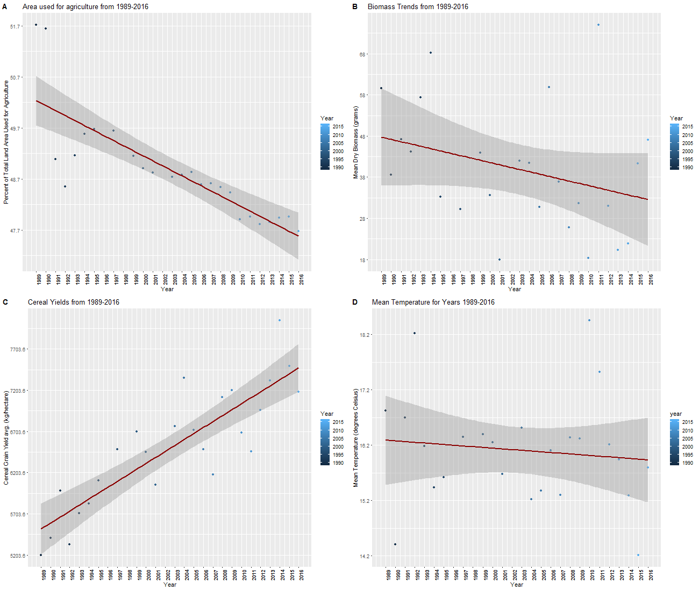
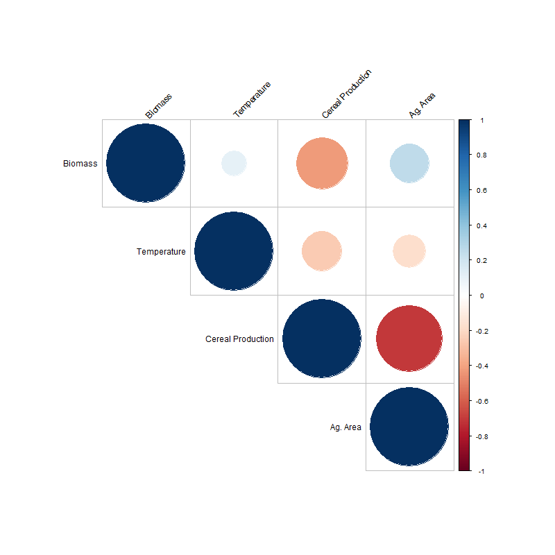
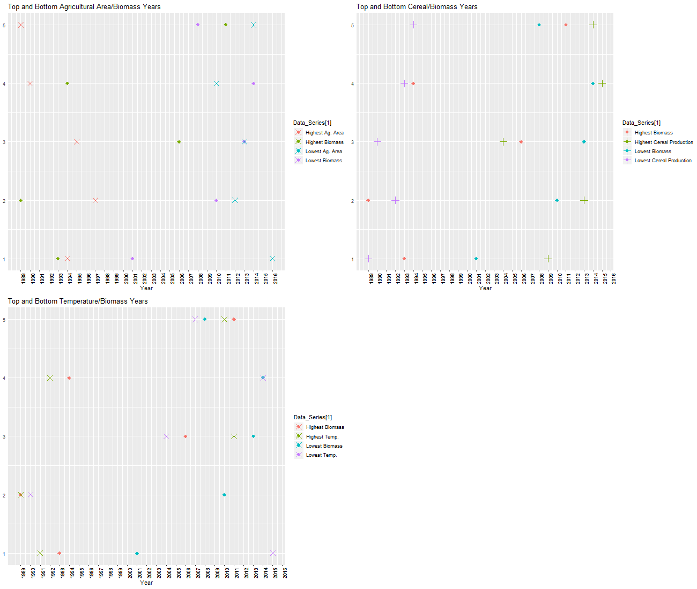

# Effect of Agriculture on Insect Populations
### Biological Question
Is there a correlation between increased agricultural area or farming practices and observed decline in insect populations? 

## Context
Around the world, flying insect populations have declined significantly in the past several decades. This decline has potentially far-reaching effects on ecosystems, since flying insects are the foundation of most terrestrial food webs and are pollinators of many agricultural species. Increased agriculture and the issues that come with it, such as habitat destruction and loss of plant diversity, are a potential cause of this decline (Benton et al. 2016, 671-673).

From 1989 to 2016, German scientists recorded insect biomass readings in protected nature areas. Their headline-reaching study showed that insect populations dropped 76% over the course of the study (Hallmann et al. 2016, 14-18). 
## Methods
#### Source of the Data
Insect biomass and temperature data were retrieved from the study "More than 75 percent decline over 27 years in total flying insect biomass in protected areas," published in the journal PLOS in 2016. This publication is open source and can be accessed at  [the PLOS website.](https://journals.plos.org/plosone/article?id=10.1371/journal.pone.0185809)

Insect biomass data can be directly accessed at the above study's [S1 dataset](https://doi.org/10.1371/journal.pone.0185809.s004). Temperature data is available in the study's [S2 dataset](https://doi.org/10.1371/journal.pone.0185809.s005). 

Agricultural percent use data were sourced from [The World Bank's publicly available data]([https://data.worldbank.org/indicator/AG.LND.AGRI.ZS?end=2016&locations=DE&start=1989](https://data.worldbank.org/indicator/AG.LND.AGRI.ZS?end=2016&locations=DE&start=1989)). Cereal production per hectare data are also available from [The World Bank's archives.](https://data.worldbank.org/indicator/AG.CON.FERT.ZS?locations=DE&view=chart) . 

#### How the Data were Produced

From 1989 to 2016, German ecologists conducted a study to measure change in insect biomass across multiple field locations in protected park areas of Germany. Their goal was to observe insect population trends within the park.

Insect biomass was measured using specialized “malaise” traps; the collected flying insects were regularly collected, weighed, and recorded. These data were recorded in the  [S1 dataset](https://doi.org/10.1371/journal.pone.0185809.s004). Since changes in climate and weather conditions were suspected to correlate with population decline, several weather-related factors at the field locations were compared to the trends in insect biomass. These data were sourced from local weather stations in Germany. Temperature and weather data is available in the  [S2 dataset](https://doi.org/10.1371/journal.pone.0185809.s005). 

Agricultural data obtained from the World Bank is collected and compiled from local governments around the world in countries with World Bank offices. Compiled data for the 27-year study period is available in my analysis' git repository at the following links: [Cereal production per hectare](/cereal_yield_per_hectare.csv) and [Agricultural percent area](/land_use_percentages.csv). Full worldwide archives are available in the previous section's links. 

The S1 dataset is 109 KB in size and 1513 lines long. The S2 dataset is 2.18 MB in size and 16,909 lines long. The two agricultural data sets are under 400 bytes and 29 lines long. There were no major issues working with the data that were specifically related to the size of the files. 

#### What the Original Authors Did with the Data
The original authors ran a JAGS test using R and used values including R2 and standard deviation to determine the correlation between insect biomass and a list of weather-related variables. In addition to the temperature data I used in my analysis, the original authors also studied precipitation, wind speed, pH, and local plant species diversity. 

In addition to the focus on what relation biomass loss had to environmental variables, the authors ran an in-depth analysis of yearly and seasonal insect biomass trends  at the various trap locations. Besides the reported overall trend of 76% biomass decline, they used this method to find declines as high as 82% during the warm season, and a yearly decline rate of up to 6% (Hallman et al. 2016, 10-14). 

#### What I Did with the Data
My analysis had three primary areas of focus: 
- First, I wanted to shrink down the large original data sets to obtain a small quantity of yearly mean data points. 
- Second, I wanted to determine what correlation existed between biomass and three related variables: agricultural area, cereal production, and mean change in temperature. 
- Third, I wanted to graph the data and compare the correlation in a visually simple and intuitive way. 

To accomplish my first step, I used several TidyVerse functions, including group_by and arrange, to easily sort the out-of-order years in the original study's first data set (S1). I took the mean of biomass for the 25 years for which data existed. I used the same method on the original study's second data set. 

The two external agricultural data sets that biomass was compared to (agricultural area and cereal production) were sourced from the World Bank data archives. The website's drag-and-drop menus allow for production of a visual graph that includes data point values for each year. Data for the 27-year study period were compiled using Microsoft Excel with two columns: Year and Percent Agricultural Area or Cereal Yield per Hectare, respectively. The only modification needed was removal of data for years that biomass data was not recorded.

To accomplish my second goal, I performed Pearson correlation tests on the biologically relevant data pairs using the aforementioned formatted data sets.

To accomplish my third goal, I made use of the packages ggplot2, Hmisc, and corrplot. I used ggplot2 to graph each data set as a scatterplot with a trendline. I used Hmisc and corrplot to visualize the correlation found between each set of variables with a correlogram. Finally, I took the highest and lowest recorded years for biomass and compared them to the most extreme years for each other variable (temperature, agricultural area, and cereal production) to check for trends regarding extremes. 
## Results and Conclusions
### Results 
The general trends for temperature, insect biomass, cereal yield, and agricultural percent area are summarized below: 

> Fig. 1. General trends of insect biomass, agricultural area, mean
> temperature, and cereal production per hectare.

As anticipated from the study's original analysis, insect biomass declined over the 27-year period. Mean temperature also had a slight decline over the study period. Percent yield significantly increased from 1989 to 2016. Percent agricultural area decreased over the study period. 

The original study's authors determined that there was a slight positive correlation between insect biomass and temperature, which is the opposite of what would be expected if climate change-related temperature shifts were causing insect biomass loss. This correlation was also not very strong, and the authors suggested that the factors were either not related or weakly related. This result was replicated in my analysis; my goal was therefore to compare the correlation between biomass/temperature with biomass/cereal production and biomass/agricultural area. 

P values for Pearson correlation tests of these variables had the following values: 

`Temperature and biomass: 0.621
` 
`Agricultural area and biomass:
0.220`
`Cereal production and biomass: 0.0321`
`Agricultural area and cereal production: 8.19e-0.5`

In Pearson correlation tests, a p-value under 0.05 indicates that the null hypothesis can be rejected, and the analysis is thus statistically significant. As anticipated, the p-value for temperature/biomass was well above 0.05. Agricultural area/biomass was also above 0.05, and these factors are not related; this defies initial expectations. Cereal production/biomass _**are**_ correlated, with a p value of 0.0321. Likewise, cereal production/agricultural area are correlated with a small p-value of 0.0000819. 

These results are visually summarized in the following correlogram: 

> Fig. 2. A plot of correlation between each variable tested (biomass,
> cereal production, temperature, agricultural percent area). A  blue
> dot with value approaching 1.0 represents a strong positive
> correlation. A red dot with value approaching -1.0 represents a strong
> negative correlation.

For a variable to cause insect biomass to decrease, a negative correlation would be expected. In Fig. 2, the strongest negative correlation related to biomass is cereal production. Cereal production is also strongly negatively correlated with agricultural area. Both of these correlations are stronger and opposite from the correlation between temperature/biomass. 

These correlation tests imply that cereal crop production has significantly increased despite agricultural land usage declining since 1989. Meanwhile, insect populations have declined inverse to crop production. Temperature is weakly positively correlated with biomass, and negatively correlated with the agricultural variables. 

Another consideration was the fact that biomass saw large spikes and declines in several years across the 27-year period. As implied by Benton et al. (2002),  insect population loss could be seen either the year of intensified agricultural activity or a year after. To analyze this phenomena, the top and bottom five years for insect biomass were compared against the highest and lowest recordings for each of the other three variables. These results are summarized below: 

> Fig. 3. For the plots above, the highest and lowest values for each
> variable were plotted. Position on the graph is relative to ranking
> out of 5.

For the plots above, if the most significant biomass drops occurred after a spike in temperature or agricultural indicators, there should be a close match between the points shown. Likewise, the opposite effect should occur for years in which biomass was the highest. 

This does not match the observed trend in data. There was no notable pattern between lowest/highest biomass years and any other variable. This implies that any effect between agricultural indicators and biomass is a cumulative effect, not a series of major biomass drops. 
### Implications
These results imply that an increase in area used for agriculture is not significantly correlated with the observed insect biomass decrease in Germany. Effects associated with agricultural land usage, including habitat fragmentation and reduction of native plant species, are therefore likely not the primary factor causing insect population decline. 

Cereal production and insect biomass were the most strongly related variables. At the same time cereal production increased, agricultural area decreased; this implies that more crops are being produced in a smaller agricultural area. To produce these crops, more intensive farming techniques must be used. Overuse of insecticides and destructive farming techniques are a known cause of native insect species decline across a range of pollinating insect species, including butterflies, bees, and aquatic species (Sanchez-Bayo and Wickhuys 2019, 18-22). My analysis' strong negative correlation between agricultural area and crop production points to the fact that intensified agriculture is related to this previously observed phenomenon.  

Data that would allow precise identification of the factors affecting flying insect species, including specific synthetic insecticide use or biomass of individual species, was not readily available for this analysis. Future studies should focus on identifying the specific variables at play in the region surrounding the original study's collection areas: how many conventional versus organic farms have been established, which native species are removed during cereal grain production, and what synthetic fertilizers and insecticides are being used in the growing season. Narrowing down these factors will lead to more actionable knowledge of which agricultural factors cause biomass decline and how the trend can be reversed. 

## References

Benton, Tim G, David M. Bryant, Lorna Cole, and Humphrey Q. P. Crick. 2002. "Linking agricultural practice to insect and bird populations: a historical study over three decades." _Journal of Applied Ecology_ 39: 673-687. [https://doi.org/10.1046/j.1365-2664.2002.00745.x](https://doi.org/10.1046/j.1365-2664.2002.00745.x)

Hallman, Caspar A., Martin Sorg, Eelke Jongejans, Henk Siepel, Nick Hofland, Heinz Shwan, Werner Stenmans, Andreas Muller, Hubert Sumser, Thomas Horren, Dave Goulson, and Hans de Kroon. 2016. "More than 75 percent decline over 27 years in total flying insect biomass in protected areas." _PLOS ONE_   12, no. 10: 1-21. [https://doi.org/10.1371/journal.pone.0185809](https://doi.org/10.1371/journal.pone.0185809). 

Sanchez-Bayo, Francisco, and Kris A. G. Wyckhuys. "Worldwide decline of the entomofauna: A review of its drivers." _Biological Conservation_   232: 8-27. [https://doi.org/10.1016/j.biocon.2019.01.020](https://doi.org/10.1016/j.biocon.2019.01.020 "Persistent link using digital object identifier").
